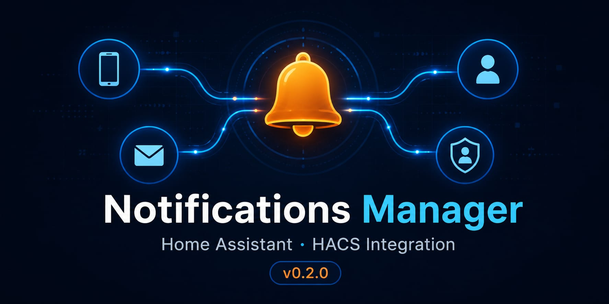

# Home Assistant Notifications Manager

Standalone HACS integration for managing notification recipients as native Home
Assistant entities, with built-in routing service and supervision panel.

Repository target:

```text
NetRunner81FR/ha-notifications-manager
```

HACS type:

```text
Integration
```

## What it provides

### Native routing service (v0.2.0+)

`notifications_manager.notify` routes notifications to users based on roles.
Since v0.3.0, passing `module:` auto-resolves roles from the package helpers
(recommended). Explicit `roles:` is still supported for backward compatibility.

```yaml
# v0.3.0+ recommended — roles resolved from helpers
service: notifications_manager.notify
data:
  title: "Alert"
  message: "Water detected in kitchen"
  category: critique
  module: inondation

# backward-compatible explicit roles (v0.2.0+)
service: notifications_manager.notify
data:
  title: "Alert"
  message: "Water detected in kitchen"
  category: critique
  roles:
    - admin
    - proprietaire
```

### Global SMTP switch (v0.2.0+)

`switch.notifications_manager_smtp_active` — global email enable/disable,
registered automatically at startup. No longer requires a manual
`input_boolean.notif_smtp_active` helper in YAML.

### Supervision panel (v0.2.0+)

Built-in panel available at `/notifications-manager` in the HA sidebar.
Loaded automatically at startup — no HACS Plugin or Lovelace resource required.

### User entities

For each user declared in `/config/notifications_users.yaml`, the integration
creates:

- `switch.notif_<id>_email_enabled`
- `switch.notif_<id>_push_enabled`
- `switch.notif_<id>_role_admin`
- `switch.notif_<id>_role_proprietaire`
- `switch.notif_<id>_role_resident`
- `switch.notif_<id>_role_utilisateur`
- `text.notif_<id>_label`
- `text.notif_<id>_email`
- `text.notif_<id>_push_target`

## Installation with HACS

1. Add this repository as a custom repository in HACS.
2. Select category `Integration`.
3. Install `Notifications Manager`.
4. Restart Home Assistant.
5. Add the YAML activation below to `configuration.yaml`:

```yaml
notifications_manager:
```

6. Copy `examples/notifications_users.yaml` to `/config/notifications_users.yaml`.
7. Restart Home Assistant.

## Calling the service from automations

```yaml
service: notifications_manager.notify
data:
  title: "Test"
  message: "Hello"
  category: info
  roles:
    - admin
```

Supported categories: `info`, `alerte`, `critique`.
Supported roles: `admin`, `proprietaire`, `resident`, `utilisateur`.

Optional fields: `source`, `alert_id`, `dedupe_key`, `priority`, `dry_run`.

## Module registry / whitelist (v0.3.2+)

`notifications_modules.yaml` at `/config/notifications_modules.yaml` is the
authoritative registry of modules allowed to send notifications. Any call to
`notifications_manager.notify` with a `module:` value not listed in `core` or
`subscribers` is rejected silently with a WARNING log — no notification is sent.

```yaml
# /config/notifications_modules.yaml
notifications_modules:
  core:
    - mqtt_watchdog
    - ha_startup
    # ... system modules, not editable by users
  subscribers:
    - inondation
    - portail
    - veilleuses_axel
    # add new business modules here
```

To add a new module: declare it in `subscribers`, create its two HA helpers
(see guard pattern below), then call `notifications_manager.reload`. No Python
change required.

## Guard pattern per business package (v0.3.0+)

Each business package declares two helpers and passes `module:` to the service.
Role resolution and cascade are handled natively by the integration.
The module must also be declared in `notifications_modules.yaml` (v0.3.2+).

```yaml
# helpers
input_select:
  inondation_notification_level:
    options: [desactive, utilisateur, resident, proprietaire]
    initial: resident

input_boolean:
  inondation_notif_admin:
    name: "Inondation - Notify admin"
    initial: true
```

```yaml
# automation action — roles resolved automatically from helpers
- service: notifications_manager.notify
  data:
    title: "Water detected"
    message: "Sensor triggered at {{ now().strftime('%H:%M') }}"
    category: critique
    module: inondation
```

Level semantics (v0.3.1+): higher privilege = fewer recipients.

| level          | recipients                                     |
| -------------- | ---------------------------------------------- |
| `proprietaire` | admin (if enabled) + proprietaire only         |
| `resident`     | admin (if enabled) + proprietaire + resident   |
| `utilisateur`  | admin (if enabled) + proprietaire + resident + utilisateur |
| `desactive`    | admin only (if `input_boolean.<module>_notif_admin` is on) |

A full copy-paste template is available in the factory repository at
`ha-config/examples/guard_pattern_v2.yaml`.

## Services

- `notifications_manager.notify` — route notification by category and roles
- `notifications_manager.add_user`
- `notifications_manager.update_user`
- `notifications_manager.remove_user`
- `notifications_manager.reload`

## Security notes

- Do not commit real email addresses unless intentionally public.
- Do not commit SMTP credentials.
- Do not commit mobile_app targets that identify private devices.
- This integration does not use MQTT.
- This integration does not call equipment control services.

## Factory compatibility

If you also use `homeassistant-factory`, ensure deployment scripts do not
overwrite `custom_components/notifications_manager/` in environments where HACS
manages this integration.
